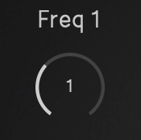
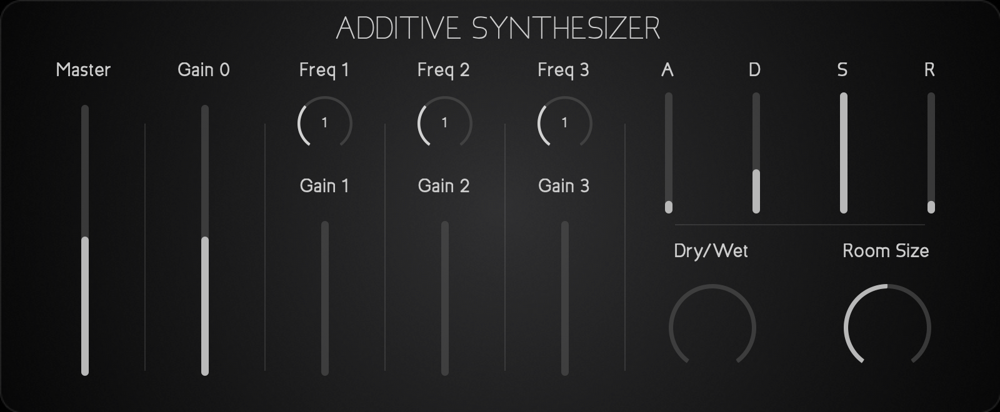

# Additive Synthesis
Additive Synthesiser made using the JUCE Framework.  

***

Additive synthesis is implemented summing multiple sinusoidal oscillators with different frequencies and gains.
This implementation includes 4 oscillators.  
The first oscillator is controlled in frequency by a MIDI input.   
Its gain is controlled in the GUI.
Both the gain and the frequency of the remaining three oscillators is controlled individually from the GUI.  

Additionally the synthesiser features an amplitude ADSR and a simple reverb.

***

